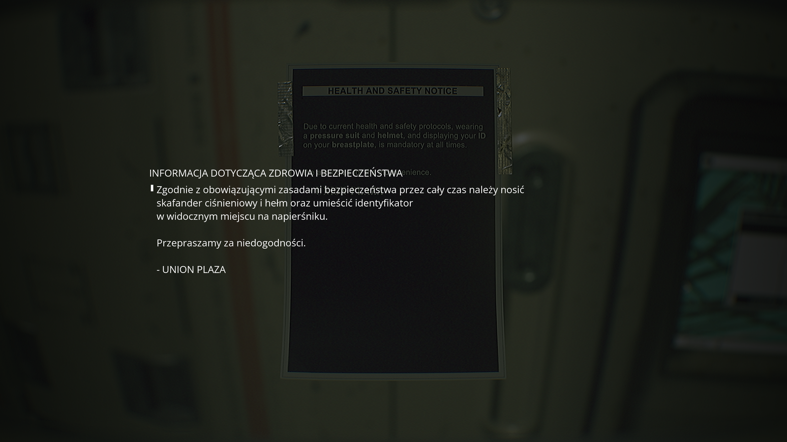
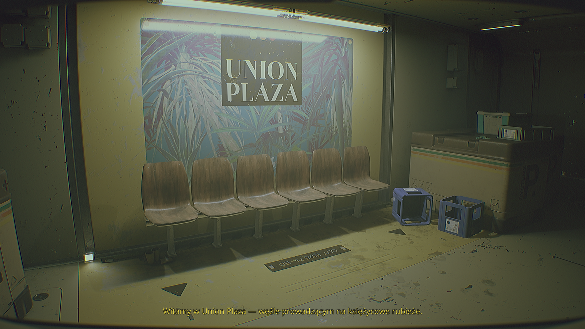
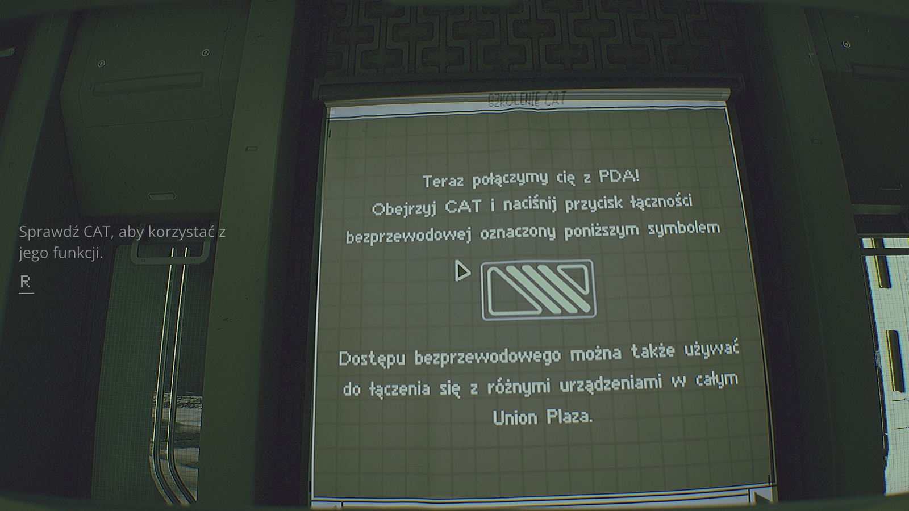

<p align="center">
  
</p>

# ROUTINE — Spolszczenie PL

Kompletne fanowskie polskie tłumaczenie gry ROUTINE.

Wersja: **v1.0.0**

Tłumaczenie obejmuje 1543 wpisy lokalizacyjne. Polski został dodany jako osobny język w menu gry, a angielska lokalizacja nie jest zastępowana. Teksty będące integralną częścią grafik lub tekstur mogą pozostać w języku oryginalnym.

## 📦 Aktualne wydanie

**v1.0.0**

Dostępne są dwie metody instalacji:

- **EXE** — automatyczny instalator marko22 (zalecany)
- **ZIP** — instalacja ręczna

➡️ [Pobierz najnowszą wersję](https://github.com/mariuszm22/ROUTINE-Spolszczenie-PL/releases/latest)

## Windows SmartScreen / instalator EXE

Windows może wyświetlić ostrzeżenie SmartScreen, ponieważ instalator EXE nie posiada komercyjnego podpisu cyfrowego. Komunikat ten nie oznacza automatycznie wykrycia wirusa. Finalny instalator ROUTINE nie ma jeszcze gotowego publicznego raportu; możesz sprawdzić plik samodzielnie w [VirusTotal](https://www.virustotal.com/gui/home/upload). Jeśli nie chcesz uruchamiać EXE, dostępna jest również wersja ZIP do instalacji ręcznej.

**SmartScreen:** kliknij **„Więcej informacji”**, a następnie **„Uruchom mimo to”**.

---

## 📷 Zrzuty ekranu

<p align="center">
  
  
</p>

<p align="center">
  
  
</p>

<p align="center">
  
  
</p>

---

## 📋 Zawartość tłumaczenia

Spolszczenie obejmuje:

- menu i interfejs użytkownika,
- dialogi,
- terminale,
- dokumenty i notatki,
- komunikaty systemowe,
- nazwy lokacji,
- pozostałe teksty lokalizacyjne zawarte w LOCRES.

---

## ⚙️ Instalacja

### 🖥️ Instalator automatyczny — EXE (zalecany)

1. Pobierz `marko22-Instalator-ROUTINE-v1.exe` z sekcji **Releases**.
2. Uruchom instalator.
3. Instalator automatycznie wykryje grę i sprawdzi zgodność wersji.
4. Jeżeli gra nie zostanie wykryta automatycznie, wskaż jej katalog ręcznie.
5. Postępuj zgodnie z instrukcjami instalatora.
6. Uruchom grę.

Jeśli gra nie uruchomi się po polsku, wybierz **język Polski** w ustawieniach.

### 📦 Instalacja ręczna — ZIP

1. Pobierz `ROUTINE_PL_v1.0.0.zip` z sekcji **Releases**.
2. Wypakuj archiwum.
3. Skopiuj plik:

   ```
   ROUTINE_PL_v1.0.0.pak
   ```

   do katalogu:

   ```
   ...\Routine\Routine\Content\Paks\
   ```

4. Uruchom grę.

Jeśli gra nie uruchomi się po polsku, wybierz **język Polski** w ustawieniach.

---

## 🗑️ Deinstalacja

### 🖥️ Spolszczenie zainstalowane przez EXE

Uruchom ponownie `marko22-Instalator-ROUTINE-v1.exe` i wybierz opcję **Odinstaluj spolszczenie**.

### 📦 Spolszczenie zainstalowane ręcznie z ZIP

Usuń plik:

```
ROUTINE_PL_v1.0.0.pak
```

z katalogu:

```
...\Routine\Routine\Content\Paks\
```

---

## 🐞 Zgłaszanie błędów

Błędy tłumaczenia można zgłaszać przez [GitHub Issues](https://github.com/mariuszm22/ROUTINE-Spolszczenie-PL/issues).

Najlepiej dołączyć:

- zrzut ekranu,
- opis miejsca występowania błędu,
- tekst lub sytuację, której dotyczy problem.

---

## ☕ Dobrowolne wsparcie

Jeżeli chcesz dobrowolnie wesprzeć dalszy rozwój projektów marko22:

➡️ [PayPal](https://paypal.me/mariuszm22)

Wsparcie projektu jest całkowicie dobrowolne.

---

## ⚠️ Informacja

Projekt jest nieoficjalnym fanowskim tłumaczeniem i nie jest powiązany z twórcami ani wydawcą ROUTINE.

---

## 🎮 Miłej gry!
