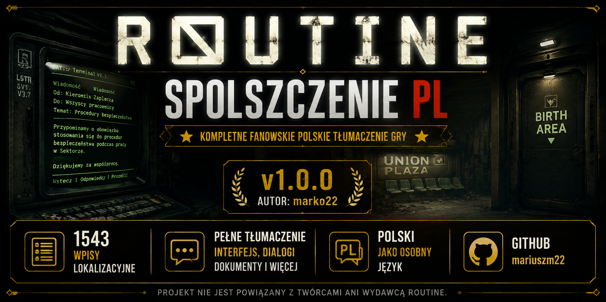
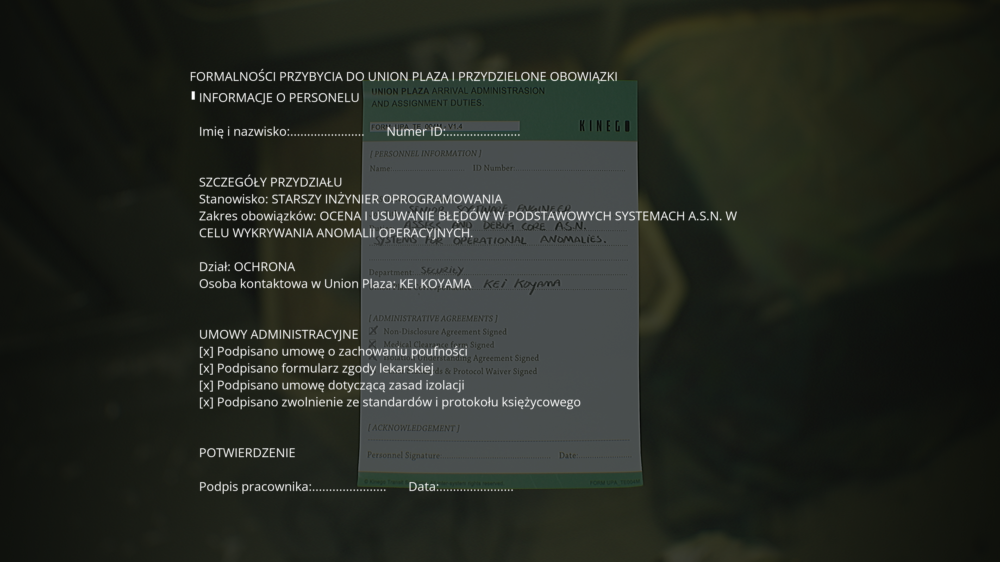
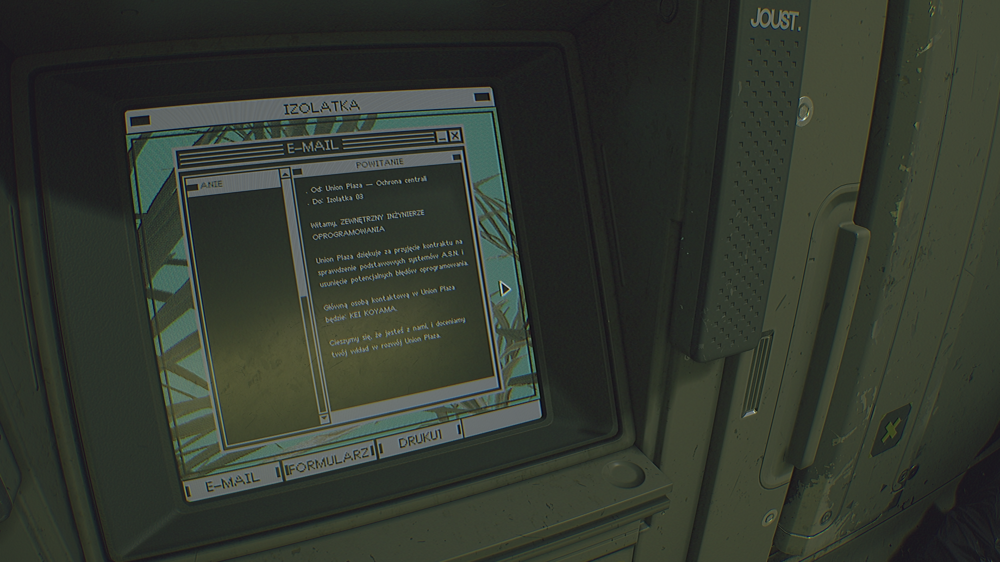
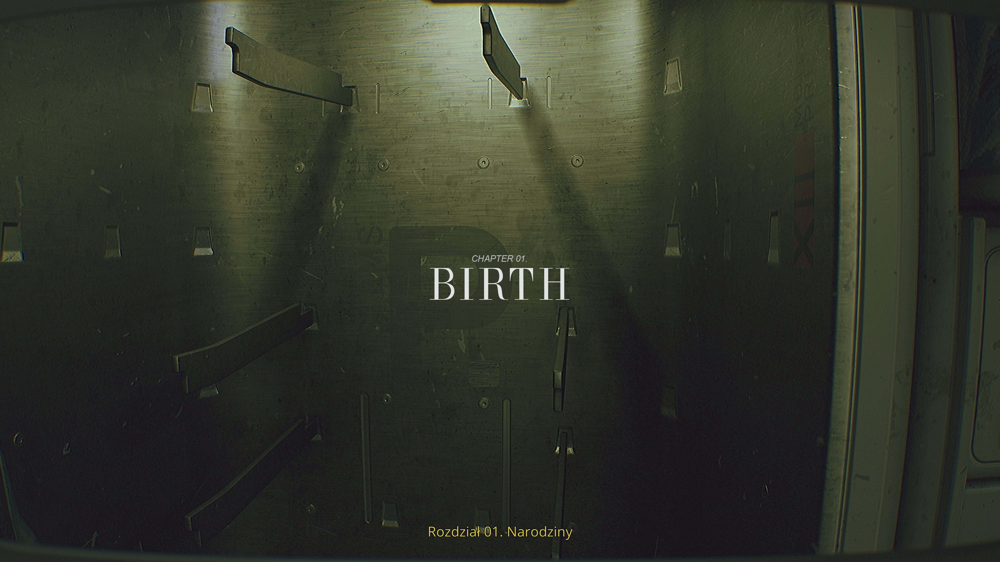

  

# ROUTINE — Spolszczenie PL

Kompletne fanowskie polskie tłumaczenie gry ROUTINE.

Wersja: **v1.0.0**

Tłumaczenie obejmuje 1543 wpisy lokalizacyjne. Polski został dodany jako osobny język w menu gry, a angielska lokalizacja nie jest zastępowana. Teksty będące integralną częścią grafik lub tekstur mogą pozostać w języku oryginalnym.

## 📦 Aktualne wydanie

**v1.0.0**

➡️ [Pobierz najnowszą wersję](https://github.com/mariuszm22/ROUTINE-Spolszczenie-PL/releases/latest)

---

## 📷 Zrzuty ekranu

  
  

  
  

  
  

## 📋 Zawartość tłumaczenia

Spolszczenie obejmuje:

- menu i interfejs użytkownika,
- dialogi,
- terminale,
- dokumenty i notatki,
- komunikaty systemowe,
- nazwy lokacji,
- pozostałe teksty lokalizacyjne zawarte w LOCRES.

## ⚙️ Instalacja

1. Pobierz `ROUTINE_PL_v1.0.0.zip` z sekcji Releases.
2. Wypakuj archiwum.
3. Skopiuj plik `ROUTINE_PL_v1.0.0.pak` do `...\Routine\Routine\Content\Paks\`.
4. Uruchom grę.
5. Wejdź w ustawienia języka i wybierz **Polski**.

## 🗑️ Deinstalacja

Usuń plik `ROUTINE_PL_v1.0.0.pak` z katalogu Paks.

## 🐞 Zgłaszanie błędów

Błędy tłumaczenia można zgłaszać przez [GitHub Issues](https://github.com/mariuszm22/ROUTINE-Spolszczenie-PL/issues).

## ☕ Dobrowolne wsparcie

Jeżeli projekt okazał się pomocny i chcesz wesprzeć jego dalszy rozwój, możesz postawić mi kawę:

➡️ [PayPal](https://paypal.me/mariuszm22)

Wsparcie jest całkowicie dobrowolne.

## ⚠️ Informacja

Projekt jest nieoficjalnym fanowskim tłumaczeniem i nie jest powiązany z twórcami ani wydawcą ROUTINE.

## 🎮 Miłej gry!
